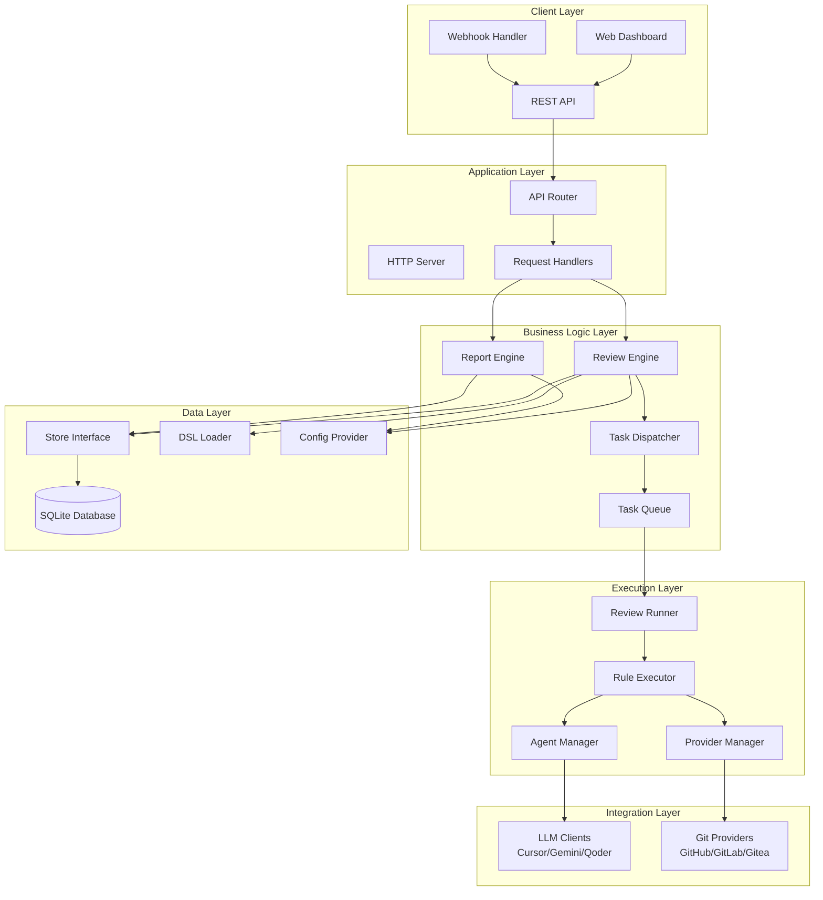
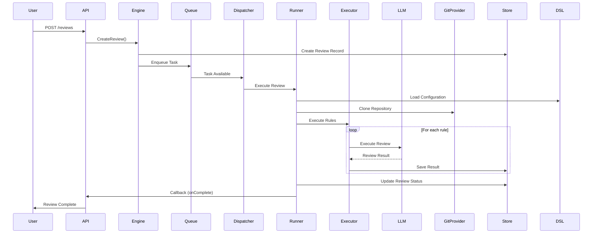
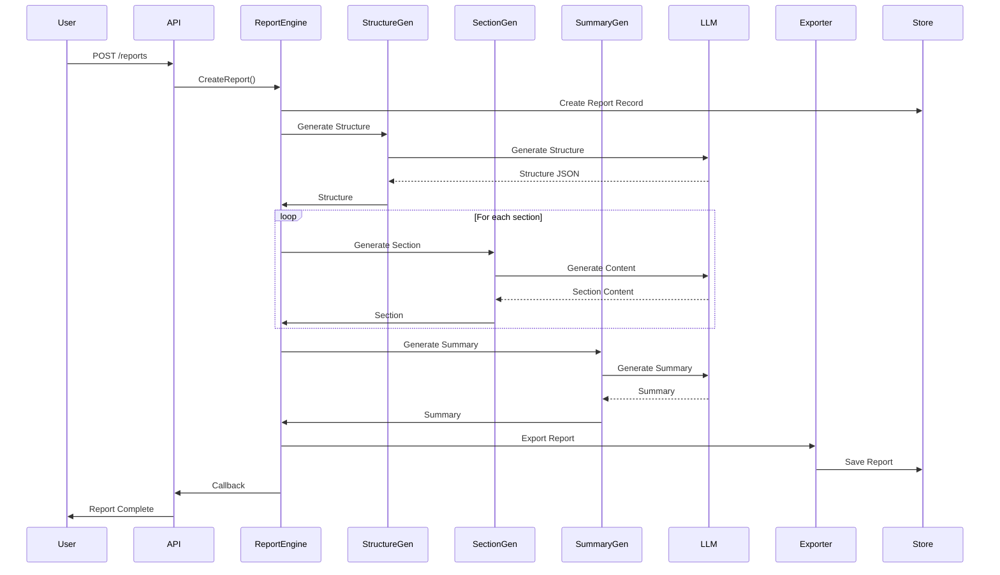

# VerustCode Architecture

This document describes the architecture and design of VerustCode.

## Overview

VerustCode is a DSL-driven AI-powered code review automation platform. It orchestrates multiple specialized AI reviewers using YAML-based configuration to perform comprehensive code analysis.

## System Architecture



## Core Components

### 1. Review Engine

The `Engine` is the main orchestration layer that manages code review tasks.

**Responsibilities:**
- Task queue management
- Repository cloning and workspace management
- DSL configuration loading
- Multi-reviewer pipeline execution
- Result aggregation and output

**Key Modules:**
- `Dispatcher`: Event-driven task dispatcher
- `RepoTaskQueue`: Per-repository task queue for serialization
- `Runner`: Executes review rules
- `Executor`: Executes individual review rules with LLM agents
- `RetryHandler`: Handles failed task retries
- `RecoveryService`: Recovers interrupted tasks

### 2. Report Engine

The `ReportEngine` orchestrates report generation tasks.

**Responsibilities:**
- Report structure generation
- Section-by-section content generation
- Summary generation
- Export to various formats (PDF, HTML, Markdown)

**Key Modules:**
- `StructureGenerator`: Generates report structure
- `SectionGenerator`: Generates individual sections
- `SummaryGenerator`: Generates executive summary
- `RepositoryManager`: Manages repository checkouts
- `Exporter`: Handles format exports

### 3. Store Layer

The `Store` interface provides data access abstraction.

**Responsibilities:**
- Database operations (CRUD)
- Transaction management
- Query optimization

**Models:**
- `Review`: Review task metadata
- `ReviewRule`: Individual review rule execution
- `ReviewRuleRun`: Multi-run execution tracking
- `ReviewResult`: Review findings and results
- `Report`: Report generation tasks
- `RepositoryReviewConfig`: Repository-specific configurations
- `Settings`: Runtime configuration storage

### 4. DSL System

The DSL (Domain-Specific Language) system provides declarative configuration.

**Components:**
- `Loader`: Loads and validates DSL configurations
- `Parser`: Parses YAML configurations
- `Validator`: Validates DSL schemas
- `Areas`: Defines review focus areas

**DSL Structure:**
```yaml
version: "1.0"
rule_base:
  agent: cursor
  output:
    format: markdown
rules:
  - id: code-quality
    goals:
      areas: [business-logic, edge-cases]
```

### 5. LLM Clients

Pluggable AI agent clients for different LLM providers.

**Supported Clients:**
- **Cursor**: Cursor Agent CLI integration
- **Gemini**: Google Gemini API
- **Qoder**: Qoder CLI integration

**Base Client Features:**
- Request preparation with security wrappers
- Model fallback mechanism
- Streaming support
- Session management
- Error handling

### 6. Git Providers

Git provider integrations for repository access.

**Supported Providers:**
- **GitHub**: GitHub API and webhooks
- **GitLab**: GitLab API and webhooks
- **Gitea**: Gitea API and webhooks

**Features:**
- Repository cloning
- PR/MR information retrieval
- Comment posting
- Webhook signature validation
- Authentication token management

### 7. Agent Manager

Manages AI agent configurations and lifecycle.

**Responsibilities:**
- Agent initialization
- Configuration hot-reload
- Agent health checking
- Session management

### 8. Provider Manager

Manages Git provider configurations.

**Responsibilities:**
- Provider initialization
- Configuration hot-reload
- Token validation
- Provider health checking

## Data Flow

### Review Flow



### Report Flow



## Database Schema

### Core Tables

**reviews**
- `id`: Review ID
- `repo_url`: Repository URL
- `ref`: Branch/tag/commit
- `status`: Review status (pending, running, completed, failed)
- `created_at`, `updated_at`: Timestamps

**review_rules**
- `id`: Rule ID
- `review_id`: Foreign key to reviews
- `rule_index`: Rule order
- `status`: Rule execution status
- `result`: Review findings (JSON)

**review_rule_runs**
- `id`: Run ID
- `rule_id`: Foreign key to review_rules
- `run_index`: Run order (for multi-run)
- `model`: LLM model used
- `result`: Run result (JSON)

**reports**
- `id`: Report ID
- `repo_url`: Repository URL
- `ref`: Branch/tag/commit
- `report_type`: Report type (wiki, security, etc.)
- `status`: Report status
- `result`: Report content (JSON)

**repository_review_configs**
- `id`: Config ID
- `repo_url`: Repository URL
- `review_file`: DSL configuration file name
- `description`: Optional description

**settings**
- `category`: Settings category (git, agents, review, etc.)
- `key`: Setting key
- `value`: Setting value (JSON)

## Configuration System

### Two-Tier Configuration

1. **Bootstrap Configuration** (`config/bootstrap.yaml`)
   - Server settings (host, port, debug)
   - Database path
   - Admin credentials
   - Logging configuration
   - Telemetry settings
   - **Requires server restart**

2. **Runtime Settings** (Database-backed)
   - Git provider configurations
   - AI agent configurations
   - Review settings
   - Report settings
   - Notification settings
   - **Takes effect immediately**

### Configuration Provider

The `ConfigProvider` interface provides unified access to configuration:

- `GetGitConfig()`: Get Git provider configurations
- `GetAgentConfig()`: Get AI agent configurations
- `GetReviewConfig()`: Get review settings
- `GetReportConfig()`: Get report settings
- `GetNotificationConfig()`: Get notification settings

## Task Queue System

### Per-Repository Queue

Tasks are queued per repository to ensure serialization:

- Prevents concurrent reviews on the same repository
- Maintains order of operations
- Reduces resource contention

### Dispatcher

Event-driven task dispatcher:

- Monitors queue for new tasks
- Dispatches tasks to workers
- Manages worker lifecycle
- Handles task cancellation

### Workers

Configurable number of concurrent workers:

- Default: 3 workers
- Configurable via `review.max_concurrent`
- Each worker processes one task at a time

## Security Architecture

### Authentication

- **JWT-based**: Stateless token authentication
- **Password Policy**: 8+ chars, mixed case, digits, special chars
- **Token Expiration**: Configurable (default: 24 hours, remember me: 7 days)

### Authorization

- **Middleware-based**: JWT validation middleware
- **Default Deny**: All endpoints require auth unless explicitly public
- **Public Endpoints**: Health check, schemas, webhooks (with signature validation)

### Webhook Security

- **GitHub/Gitea**: HMAC-SHA256 signature verification
- **GitLab**: Token-based validation
- **Secret Configuration**: Required for all providers

### Input Validation

- **Path Traversal Protection**: Filename validation
- **YAML Injection Prevention**: Safe parsing
- **SQL Injection Prevention**: GORM parameterized queries

## Error Handling

### Error Types

- **AppError**: Structured application errors with codes
- **Error Codes**: Categorized by domain (1xxx: general, 2xxx: git, 3xxx: agent, etc.)
- **Error Wrapping**: Context-preserving error wrapping

### Error Response Format

```json
{
  "code": "E1001",
  "message": "Validation error",
  "details": "Additional context"
}
```

## Observability

### Logging

- **Structured Logging**: Zap logger with structured fields
- **Log Levels**: Debug, Info, Warn, Error, Fatal
- **Log Rotation**: Configurable file-based logging with rotation
- **Task Logs**: Separate database for task execution logs

### Metrics

- **Prometheus**: Metrics endpoint (`/metrics`)
- **OpenTelemetry**: Distributed tracing support
- **Custom Metrics**: Review counts, queue sizes, execution times

### Tracing

- **OpenTelemetry**: OTLP exporter support
- **Jaeger Integration**: Distributed tracing visualization
- **Span Context**: Request ID propagation

## Extension Points

### Adding New LLM Clients

1. Implement `base.Agent` interface
2. Register in `internal/agent/agents`
3. Configure in settings

### Adding New Git Providers

1. Implement `provider.Provider` interface
2. Register in `internal/git/providers`
3. Configure in settings

### Adding New Output Channels

1. Implement `output.Channel` interface
2. Register in output channel factory
3. Configure in DSL

### Adding New Report Types

1. Create report type YAML configuration
2. Place in `config/reports/`
3. Configure structure and sections

## Performance Considerations

### Concurrency

- **Worker Pool**: Configurable concurrent workers
- **Per-Repo Serialization**: Prevents conflicts
- **Async Processing**: Non-blocking task execution

### Caching

- **DSL Config Cache**: Cached DSL configurations
- **Provider Config Cache**: Hot-reloadable provider configs
- **Agent Config Cache**: Hot-reloadable agent configs

### Resource Management

- **Workspace Cleanup**: Automatic cleanup of cloned repositories
- **Connection Pooling**: Database connection pooling
- **Memory Management**: Efficient data structures

## Deployment Architecture

### Single Binary

- **Embedded Frontend**: Frontend built into binary
- **Embedded Configs**: Default configurations embedded
- **SQLite Database**: File-based database (no external DB required)

### Docker Deployment

- **Multi-stage Build**: Optimized image size
- **Non-root User**: Security best practices
- **Health Checks**: Built-in health check endpoint

### Scaling Considerations

- **Horizontal Scaling**: Stateless design allows multiple instances
- **Shared Database**: SQLite not suitable for multi-instance (consider PostgreSQL)
- **Load Balancer**: Required for multiple instances

## Future Enhancements

- **PostgreSQL Support**: For multi-instance deployments
- **Redis Integration**: For distributed task queue
- **WebSocket Support**: Real-time task updates
- **Plugin System**: Dynamic plugin loading
- **Multi-tenancy**: Support for multiple organizations
